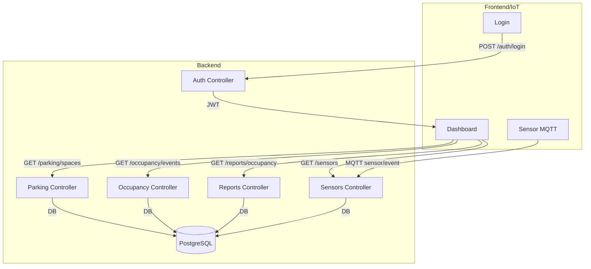
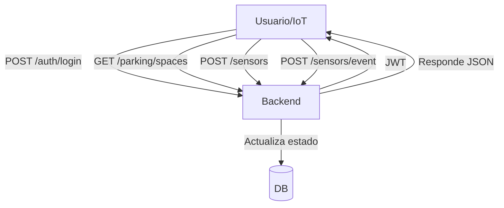

# 🚗 ParkingAccess - Sistema de Gestión Inteligente de Estacionamientos

> Proyecto académico para la gestión y monitoreo de estacionamientos con sensores IoT, backend NestJS, PostgreSQL y Docker.

---

## Índice
- [¿Qué es ParkingAccess?](#qué-es-parkingaccess)
- [Estructura del Proyecto](#estructura-del-proyecto)
- [Instalación y Ejecución](#instalación-y-ejecución)
- [Variables de Entorno](#variables-de-entorno)
- [Comandos Útiles](#comandos-útiles)
- [Endpoints Principales](#endpoints-principales)
- [Ejemplos de Uso](#ejemplos-de-uso)
- [Integración MQTT](#integración-mqtt)
- [Seguridad y Buenas Prácticas](#seguridad-y-buenas-prácticas)
- [Testing](#testing)
- [Glosario](#glosario)
- [Diagramas](#diagramas)
- [Contacto](#contacto)

---

## ¿Qué es ParkingAccess?

ParkingAccess es una API RESTful modular que permite:
- Gestión de espacios de estacionamiento
- Monitoreo en tiempo real con sensores IoT (MQTT)
- Control de acceso y usuarios (roles)
- Reportes y analytics
- Seguridad JWT y validación de datos

---

## Estructura del Proyecto

```text
parking-access/
├── src/
│   ├── app.module.ts
│   ├── main.ts
│   ├── common/           # Decoradores y guards
│   ├── database/         # Configuración TypeORM
│   └── modules/
│       ├── auth/         # Autenticación y roles
│       ├── occupancy/    # Eventos de ocupación
│       ├── parking/      # Espacios de estacionamiento
│       ├── reports/      # Reportes y métricas
│       ├── sensors/      # Sensores IoT
│       └── users/        # Gestión de usuarios
├── test/                 # Tests unitarios y de integración
├── Dockerfile
├── docker-compose.yml
├── package.json
└── README.md
```

---

## Instalación y Ejecución

1. **Clona el repositorio y entra al proyecto**
   ```bash
   git clone <url-del-repo>
   cd parking-access
   ```
2. **Instala dependencias**
   ```bash
   npm install
   ```
3. **Configura las variables de entorno**
   Copia `.env.example` a `.env` y ajusta según tu entorno.
4. **Levanta todo con Docker**
   ```bash
   docker-compose up --build -d
   ```
5. **Comandos útiles**
   ```bash
   npm run start:dev   # Desarrollo
   npm run test        # Tests unitarios
   npm run lint        # Linting
   docker-compose logs -f  # Ver logs
   ```

---

## Variables de Entorno

```env
DB_HOST=localhost
DB_PORT=5432
DB_USER=admin
DB_PASSWORD=admin123
DB_NAME=parkingdb
PORT=3000
JWT_SECRET=supersecret
MQTT_BROKER_URL=mqtt://localhost:1883
```

---

## Comandos Útiles

| Comando                        | Descripción                        |
|--------------------------------|------------------------------------|
| npm run start:dev              | Hot reload (desarrollo)            |
| npm run lint                   | Linting                            |
| npm run test                   | Tests unitarios                    |
| npm run test:cov               | Cobertura de tests                 |
| npm run build                  | Build producción                   |
| npm run start:prod             | Ejecutar en producción             |
| docker-compose up --build -d   | Levanta backend y base de datos    |
| docker-compose down            | Detiene todo                       |
| docker-compose logs -f         | Logs en tiempo real                |

---


## Endpoints Principales y Ejemplos Detallados

### Autenticación
| Método | Endpoint         | Descripción         | Roles |
|--------|------------------|---------------------|-------|
| POST   | /auth/login      | Login de usuario    | Todos |
| POST   | /auth/register   | Registro            | Admin |

**Ejemplo Login:**
```http
POST /auth/login
{
  "username": "admin",
  "password": "admin123"
}
// Respuesta
{
  "access_token": "<jwt>",
  "user": { "id": "uuid", "username": "admin", "role": "admin" }
}
```
**Error común:**
```json
{
  "message": "Unauthorized"
}
```

### Usuarios
| Método | Endpoint        | Descripción         | Roles  |
|--------|-----------------|---------------------|--------|
| POST   | /users          | Crear usuario       | Admin  |
| GET    | /users          | Listar usuarios     | Admin  |
| GET    | /users/:id      | Obtener por ID      | Admin  |
| PATCH  | /users/:id      | Editar usuario      | Admin  |
| DELETE | /users/:id      | Eliminar (soft)     | Admin  |

**Ejemplo crear:**
```http
POST /users
{
  "email": "nuevo@ejemplo.com",
  "password": "123456",
  "role": "user"
}
// Respuesta
{
  "message": "Usuario creado con éxito",
  "user": { "id": "uuid", "email": "nuevo@ejemplo.com", ... }
}
```
**Obtener todos:**
```http
GET /users
// Respuesta
[
  { "id": "uuid", "email": "admin@ejemplo.com", "role": "admin" },
  { "id": "uuid", "email": "user1@ejemplo.com", "role": "user" }
]
```
**Editar:**
```http
PATCH /users/:id
{
  "email": "nuevo2@ejemplo.com"
}
// Respuesta
{
  "message": "Usuario actualizado con éxito", "user": { ... }
}
```
**Eliminar:**
```http
DELETE /users/:id
// Respuesta
{
  "message": "Usuario eliminado (soft delete) con éxito" 
}
```

### Espacios de Estacionamiento
| Método | Endpoint                  | Descripción           | Roles  |
|--------|---------------------------|-----------------------|--------|
| POST   | /parking/spaces           | Crear espacio         | Admin  |
| POST   | /parking/spaces/multiple  | Crear múltiples       | Admin  |
| GET    | /parking/spaces           | Listar espacios       | Todos  |
| GET    | /parking/spaces/:id       | Obtener por ID        | Todos  |
| PUT    | /parking/spaces/:id       | Editar espacio        | Admin  |
| DELETE | /parking/spaces/:id       | Eliminar (soft)       | Admin  |

**Ejemplo crear:**
```http
POST /parking/spaces
{
  "status": "free",
  "floor": "1"
}
// Respuesta
{
  "message": "Espacio creado con éxito",
  "space": { "id": "uuid", "spaceCode": "A-01", "status": "free", ... }
}
```
**Obtener todos:**
```http
GET /parking/spaces
// Respuesta
[
  { "id": "uuid", "spaceCode": "A-01", "status": "free" },
  { "id": "uuid", "spaceCode": "A-02", "status": "occupied" }
]
```
**Editar:**
```http
PUT /parking/spaces/:id
{
  "status": "occupied"
}
// Respuesta
{
  "message": "Espacio actualizado con éxito", "space": { ... }
}
```
**Eliminar:**
```http
DELETE /parking/spaces/:id
// Respuesta
{
  "message": "Espacio eliminado con éxito" 
}
```

### Sensores
| Método | Endpoint         | Descripción                | Roles  |
|--------|------------------|----------------------------|--------|
| POST   | /sensors         | Crear sensor               | Admin  |
| GET    | /sensors         | Listar sensores            | Todos  |
| GET    | /sensors/:id     | Obtener por ID             | Todos  |
| PATCH  | /sensors/:id     | Editar sensor              | Admin  |
| DELETE | /sensors/:id     | Eliminar (soft)            | Admin  |
| POST   | /sensors/event   | Evento de sensor (IoT)     | IoT    |

**Ejemplo crear:**
```http
POST /sensors
{
  "hwId": "sensor-123",
  "type": "ultrasonic",
  "locationDescription": "Piso 1, A-01",
  "parkingSpaceId": "uuid-espacio"
}
// Respuesta
{
  "message": "Sensor creado con éxito",
  "sensor": { ... }
}
```
**Evento IoT:**
```http
POST /sensors/event
{
  "hwId": "sensor-123",
  "status": "occupied"
}
// Respuesta
{
  "message": "Evento procesado y estado actualizado con éxito",
  "event": { ... }
}
```

### Ocupación
| Método | Endpoint                        | Descripción                | Roles  |
|--------|----------------------------------|----------------------------|--------|
| POST   | /occupancy                      | Crear evento               | Todos  |
| GET    | /occupancy                      | Listar eventos             | Todos  |
| GET    | /occupancy/event/:id            | Obtener evento por ID      | Todos  |
| PATCH  | /occupancy/event/:id            | Editar evento              | Todos  |
| DELETE | /occupancy/event/:id            | Eliminar evento (soft)     | Todos  |
| GET    | /occupancy/history/:parkingSpaceId | Historial por espacio   | Todos  |

**Ejemplo crear:**
```http
POST /occupancy
{
  "parkingSpaceId": "uuid",
  "status": "OCCUPIED"
}
// Respuesta
{
  "message": "Evento de ocupación creado con éxito",
  "event": { ... }
}
```
**Obtener todos:**
```http
GET /occupancy
// Respuesta
[
  { "id": "uuid", "parkingSpace": { "id": "uuid" }, "status": "occupied", "timestamp": "2025-09-07T12:01:00.000Z" }
]
```
**Editar evento:**
```http
PATCH /occupancy/event/:id
{
  "status": "FREE"
}
// Respuesta
{
  "message": "Evento actualizado con éxito", "event": { ... }
}
```
**Eliminar:**
```http
DELETE /occupancy/event/:id
// Respuesta
{
  "message": "Evento eliminado con éxito" 
}
```

### Reportes
| Método | Endpoint              | Descripción             | Roles  |
|--------|-----------------------|-------------------------|--------|
| GET    | /reports/occupancy    | Reporte de ocupación    | Todos  |

**Ejemplo respuesta:**
```json
{
  "totalSpaces": 10,
  "occupied": 4,
  "free": 6,
  "occupancyRate": 0.4
}
```

---

## Estructura de Entidades

### Usuario (`User`)
```json
{
  "id": "uuid",
  "username": "string",
  "email": "string",
  "role": "admin" | "user",
  "createdAt": "date",
  "updatedAt": "date"
}
```

### Espacio de Estacionamiento (`ParkingSpace`)
```json
{
  "id": "uuid",
  "spaceCode": "A-01",
  "status": "free" | "occupied" | "unknown",
  "sensors": [ ... ],
  "createdAt": "date",
  "updatedAt": "date"
}
```

### Sensor (`Sensor`)
```json
{
  "id": "uuid",
  "hwId": "sensor-123",
  "type": "ultrasonic" | "infrared",
  "locationDescription": "string",
  "active": true,
  "parkingSpace": { ... },
  "createdAt": "date",
  "updatedAt": "date"
}
```

### Evento de Ocupación (`OccupancyEvent`)
```json
{
  "id": "uuid",
  "parkingSpace": { ... },
  "status": "free" | "occupied" | "unknown",
  "timestamp": "date"
}
```

---

## Flujos de Autenticación y Consumo

1. **Login y obtención de token**
   - Enviar credenciales a `/auth/login` y recibir un JWT.
2. **Consumo de endpoints protegidos**
   - Enviar el header `Authorization: Bearer <jwt>` en cada request.
   - Si el token es inválido o falta, se recibe:
     ```json
     { "message": "Unauthorized" }
     ```
3. **Registrar y monitorear un sensor**
   - Registrar sensor (admin):
     ```http
     POST /sensors
     {
       "hwId": "sensor-123",
       "type": "ultrasonic",
       "locationDescription": "Piso 1, A-01",
       "parkingSpaceId": "uuid-espacio"
     }
     // Respuesta
     {
       "message": "Sensor creado con éxito",
       "sensor": { ... }
     }
     ```
   - Enviar evento de sensor (IoT):
     ```http
     POST /sensors/event
     {
       "hwId": "sensor-123",
       "status": "occupied"
     }
     // Respuesta
     {
       "message": "Evento procesado y estado actualizado con éxito",
       "event": { ... }
     }
     ```

---

## Errores Comunes

- Autenticación fallida:
  ```json
  { "message": "Unauthorized" }
  ```
- Validación de datos:
  ```json
  { "message": "Error al crear el sensor", "error": "ParkingSpace no encontrado" }
  ```
- Acceso denegado:
  ```json
  { "message": "Forbidden" }
  ```

---

## Recomendaciones para Frontend

- Usar siempre el token JWT para endpoints protegidos.
- Validar los campos requeridos antes de enviar requests.
- Manejar errores mostrando el campo `message` y, si existe, `error`.
- Para listas, paginar en frontend si la respuesta es grande.
- Los endpoints de sensores y ocupación pueden ser usados para dashboards en tiempo real.
- Usar los endpoints de reportes para analytics y visualizaciones.
- Mockear datos en desarrollo usando los ejemplos de este README.

---

## Reglas para Documentación Técnica

- Documentar cada endpoint con:
  - Método y ruta
  - Descripción
  - Roles requeridos
  - Ejemplo de request y response
  - Ejemplo de error
- Mantener actualizado este README si se agregan o cambian endpoints.
- Usar los ejemplos de entidades y flujos de este archivo como referencia.

---

---

## Integración MQTT

- El backend se suscribe al tópico `sensor/event`.
- Los dispositivos pueden publicar eventos MQTT con payload:
  ```json
  {
    "hwId": "sensor-123",
    "status": "occupied"
  }
  ```
- Ejemplo de publicación MQTT (Node.js):
  ```js
  const mqtt = require('mqtt');
  const client = mqtt.connect('mqtt://localhost:1883');
  client.on('connect', () => {
    client.publish('sensor/event', JSON.stringify({ hwId: 'sensor-123', status: 'occupied' }));
  });
  ```

---

## Seguridad y Buenas Prácticas

- **JWT**: Todos los endpoints protegidos requieren el header `Authorization: Bearer <token>`. No compartir tokens, expiran cada 24h.
- **Roles**: `admin` (gestiona todo), `user` (acceso limitado)
- **Contraseñas**: Siempre encriptadas (bcrypt).
- **Validación**: Todos los DTOs usan class-validator.
- **CORS**: Solo orígenes permitidos.
- **Helmet**: Headers de seguridad HTTP.
- **Logs**: No exponer datos sensibles en logs.
- **Errores**: Siempre devolver formato `{ message, error? }`.

---

## Testing

```bash
npm run test
npm run test:watch
npm run test:cov
```

---

## Glosario

- **DTO**: Data Transfer Object, define la forma de los datos de entrada/salida.
- **JWT**: JSON Web Token, para autenticación.
- **MQTT**: Protocolo ligero para IoT.
- **OccupancyEvent**: Evento de cambio de estado de un espacio.
- **ParkingSpace**: Lugar físico de estacionamiento.
- **Sensor**: Dispositivo IoT que detecta ocupación.

---

## Diagramas

### Diagrama de Flujo General


### Diagrama de Flujo Simplificado


---

## Contacto

Para dudas técnicas, sugerencias o reportes, contactar al equipo backend o abrir un issue en el repositorio.

---
Desarrollado con ❤️ usando NestJS, TypeScript, PostgreSQL y Docker.